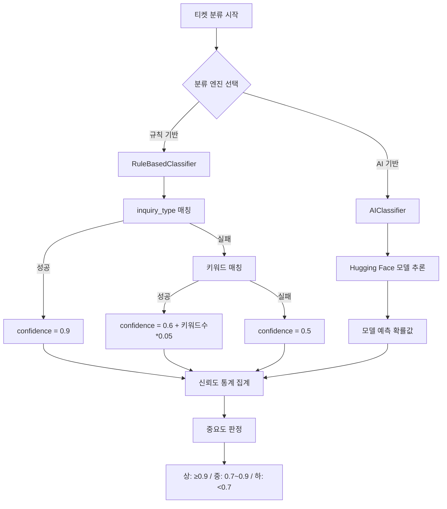

# 티켓 자동분류 신뢰도 측정 로직 분석

## 📋 목차

1. [개요](#개요)
2. [신뢰도 측정 프로세스](#신뢰도-측정-프로세스)
3. [신뢰도 계산 방식](#신뢰도-계산-방식)
4. [신뢰도 통계 집계](#신뢰도-통계-집계)
5. [수치 설정 기준 분석](#수치-설정-기준-분석)
6. [문제점 및 개선 방안](#문제점-및-개선-방안)

---

## 개요

`services/auto_classify.py` 파일에서 진행하는 티켓 자동분류 시 신뢰도(confidence)를 측정하는 로직에 대한 상세 분석 문서입니다.

신뢰도 측정은 크게 **3단계**로 진행됩니다:

1. 개별 티켓 분류 시 신뢰도 계산
2. 전체 티켓 신뢰도 통계 집계
3. 티켓 중요도 판정

---

## 신뢰도 측정 프로세스



---

## 신뢰도 계산 방식

### 1️⃣ 규칙 기반 분류 (RuleBasedClassifier)

**파일 위치:** `utils/classifiers/rule_based_classifier.py`

#### 신뢰도 계산 케이스

| 케이스                     | 신뢰도                            | 조건                                     |
| -------------------------- | --------------------------------- | ---------------------------------------- |
| **inquiry_type 매칭 성공** | `0.9`                             | `inquiry_type` 필드가 규칙과 정확히 매칭 |
| **키워드 기반 매칭**       | `min(0.9, 0.6 + 키워드수 × 0.05)` | 본문/제목에서 키워드 발견                |
| **매칭 실패 (기타 분류)**  | `0.5`                             | 어떤 규칙에도 매칭되지 않음              |
| **시스템 오류**            | `0.3`                             | 카테고리 ID 조회 실패 등                 |

#### 코드 예시

```python
# 1. inquiry_type 필드로 매칭 성공 시
confidence = 0.9  # 높은 신뢰도

# 2. 본문/제목 키워드 기반 매칭 시
# - 매칭된 키워드 개수에 따라 점수 계산
confidence = min(0.9, 0.6 + (matched_count * 0.05))  # 최대 0.9

# 3. 매칭 실패 시 (기타 분류)
confidence = 0.5
```

#### 키워드 매칭 신뢰도 계산 예시

```python
# 키워드 1개 매칭
confidence = 0.6 + (1 * 0.05) = 0.65 (65%)

# 키워드 3개 매칭
confidence = 0.6 + (3 * 0.05) = 0.75 (75%)

# 키워드 6개 매칭
confidence = 0.6 + (6 * 0.05) = 0.9 (90%)

# 키워드 10개 매칭
confidence = min(0.9, 0.6 + 10*0.05) = min(0.9, 1.1) = 0.9 (최대 90%)
```

#### 실제 분류 로직

**파일:** `utils/classifiers/rule_based_classifier.py` (163-230행)

```python
def classify_ticket(self, ticket: Dict[str, Any]) -> Dict[str, Any]:
    inquiry_type = (ticket.get('inquiry_type') or '').strip()
    body = ticket.get('body') or ''
    title = ticket.get('title') or ''

    # 1. inquiry_type으로 카테고리 매핑 시도
    if inquiry_type:
        category_name = self.inquiry_rules.get(inquiry_type)
        if category_name:
            confidence = 0.9  # inquiry_type 매칭 시 높은 신뢰도

    # 2. inquiry_type 매칭 실패 시 본문/제목 키워드 기반 추론
    if not category_name:
        category_name, confidence, matched_keywords = self._classify_by_keywords(body, title)

    # 3. 여전히 실패 시 '기타'로 분류
    if not category_name:
        category_name = '기타'
        confidence = 0.5

    return {
        'category_id': category_id,
        'category_name': category_name,
        'confidence': confidence,
        'keywords': keywords,
        'method': 'rule_based'
    }
```

---

### 2️⃣ AI 기반 분류 (AIClassifier)

**파일 위치:** `utils/classifiers/ai_classifier.py`

#### 신뢰도 계산 방식

- **Hugging Face 모델이 직접 계산한 확률값 사용**
- `result['scores'][0]` - 가장 높은 카테고리의 예측 확률
- **범위:** 0.0 ~ 1.0 (모델에 따라 다름)

#### 코드 예시

```python
# Zero-shot classification 실행
result = self.pipeline(
    text,
    candidate_labels=self.category_labels,
    hypothesis_template="This text is about {}."
)

# 결과 파싱
best_label = result['labels'][0]
best_score = result['scores'][0]  # 모델이 계산한 확률값

return {
    'category_id': category_id,
    'category_name': best_label,
    'confidence': float(best_score),  # 신뢰도로 사용
    'method': 'ai_huggingface'
}
```

---

## 신뢰도 통계 집계

**파일:** `services/auto_classify.py` (192-225행)

모든 티켓 분류 후, `_calculate_reliability_stats` 메서드가 호출되어 전체 통계를 계산합니다.

### 계산되는 지표

| 지표                      | 설명                | 기준                        |
| ------------------------- | ------------------- | --------------------------- |
| `total_tickets`           | 전체 티켓 수        | -                           |
| `average_confidence`      | 평균 신뢰도         | 모든 티켓의 신뢰도 평균     |
| `high_confidence_count`   | 높은 신뢰도 티켓 수 | 신뢰도 ≥ 0.8                |
| `high_confidence_ratio`   | 높은 신뢰도 비율    | high_count / total          |
| `medium_confidence_count` | 중간 신뢰도 티켓 수 | 0.7 ≤ 신뢰도 < 0.8          |
| `medium_confidence_ratio` | 중간 신뢰도 비율    | medium_count / total        |
| `low_confidence_count`    | 낮은 신뢰도 티켓 수 | 신뢰도 < 0.7                |
| `low_confidence_ratio`    | 낮은 신뢰도 비율    | low_count / total           |
| `needs_review_count`      | 재검토 필요 티켓 수 | low_confidence_count와 동일 |

### 코드

```python
def _calculate_reliability_stats(self, classifications: List[Dict]) -> Dict[str, Any]:
    """신뢰도 통계 계산"""
    confidences = [item['classification']['confidence'] for item in classifications]
    total = len(confidences)

    # 평균 신뢰도
    avg_confidence = sum(confidences) / total

    # 신뢰도 분포 계산
    high_conf = sum(1 for c in confidences if c >= 0.8)      # 80% 이상: 높음
    medium_conf = sum(1 for c in confidences if 0.7 <= c < 0.8)  # 70~80%: 중간
    low_conf = sum(1 for c in confidences if c < 0.7)        # 70% 미만: 낮음

    return {
        'total_tickets': total,
        'average_confidence': round(avg_confidence, 3),
        'high_confidence_count': high_conf,
        'high_confidence_ratio': round(high_conf / total, 3),
        'medium_confidence_count': medium_conf,
        'medium_confidence_ratio': round(medium_conf / total, 3),
        'low_confidence_count': low_conf,
        'low_confidence_ratio': round(low_conf / total, 3),
        'needs_review_count': low_conf  # 재검토 필요
    }
```

---

## 티켓 중요도 판정

**파일:** `services/auto_classify.py` (352-359행)

개별 티켓의 중요도는 신뢰도를 기반으로 판정됩니다.

### 중요도 기준

| 중요도 | 신뢰도 범위 | 의미                               |
| ------ | ----------- | ---------------------------------- |
| **상** | ≥ 0.9       | 매우 확실한 분류, 그대로 사용 가능 |
| **중** | 0.7 ~ 0.9   | 일반적인 분류, 대부분 정확         |
| **하** | < 0.7       | 재검토 필요, 수동 확인 권장        |

### 코드

```python
def _calculate_importance(self, confidence: float) -> str:
    """신뢰도 기반 중요도 계산"""
    if confidence >= 0.9:
        return '상'
    elif confidence >= 0.7:
        return '중'
    else:
        return '하'
```

---

## 수치 설정 기준 분석

### 🔍 왜 최대값이 0.9 (90%)인가?

**규칙 기반 분류는 100% 확신할 수 없기 때문입니다.**

#### 이유

| 제약사항        | 설명                                              |
| --------------- | ------------------------------------------------- |
| **사람의 실수** | `inquiry_type` 필드를 잘못 선택할 수 있음         |
| **데이터 품질** | 오타, 모호한 표현, 복합적인 문의 존재             |
| **맥락 부족**   | 규칙 기반은 단어 매칭만으로 판단 (의미 파악 불가) |
| **보수적 접근** | 10%의 불확실성을 남겨두는 것이 현실적             |

#### 실제 예시

```text
티켓: "배송이 늦어서 환불해주세요"
→ '배송' 키워드로 분류되지만, 실제 의도는 '환불'일 수 있음
→ 100% 확신할 수 없으므로 90%가 적절
```

---

### 📊 각 수치를 정한 기준

| 상황                   | 신뢰도    | 기준 설명                                                  |
| ---------------------- | --------- | ---------------------------------------------------------- |
| **inquiry_type 매칭**  | **0.9**   | 구조화된 필드 기반 → 가장 신뢰도 높음 (하지만 100%는 아님) |
| **키워드 매칭 (기본)** | **0.6**   | 키워드 1개만 발견되어도 60%부터 시작 (절반 이상 확신)      |
| **키워드 1개당 증가**  | **+0.05** | 키워드가 많을수록 신뢰도 증가 (6개 이상 → 0.9 도달)        |
| **매칭 실패 (기타)**   | **0.5**   | 전혀 모를 때 50% - 중립적 입장                             |
| **시스템 오류**        | **0.3**   | 분류 자체가 실패한 경우 - 가장 낮은 신뢰도                 |

#### 수치의 의미

```python
# 0.9: "매우 확신하지만 완벽하지는 않음"
# - inquiry_type이 명확하거나 키워드가 6개 이상 매칭

# 0.6: "절반 이상은 확신함"
# - 키워드 1개만 발견된 경우의 기본값
# - 최소한의 근거가 있는 상태

# 0.05: "키워드 1개당 5% 신뢰도 증가"
# - 키워드가 많을수록 확실도가 높아짐
# - 6개 이상이면 최대치(0.9) 도달

# 0.5: "모르겠음 (중립)"
# - 아무런 근거가 없는 상태
# - 무작위 추측보다는 나은 수준

# 0.3: "심각한 문제"
# - 시스템 오류나 데이터 이상
# - 사람의 검토가 필수적으로 필요
```

---

## 문제점 및 개선 방안

### ❌ 현재의 한계

#### 1. 과학적 근거 부족

- 0.6, 0.05 같은 값이 **경험적/휴리스틱**하게 정해짐
- 실제 검증 없이 "그럴듯한" 숫자로 설정

#### 2. 데이터 검증 없음

- **실제 정확도와 신뢰도가 일치하는지 확인 안 됨**
- 신뢰도 0.9라고 했는데 실제로는 70%만 정확할 수도 있음

#### 3. 일률적 적용

- 모든 카테고리에 동일한 기준 적용
- 카테고리마다 분류 난이도가 다른데 고려 안 됨

#### 4. 신뢰도 캘리브레이션 부재

- 모델이 자신감 있게 틀릴 수 있음 (Overconfidence)
- 신뢰도와 실제 정확도 간 괴리 가능

---

### ✅ 개선 방안

#### 1. 실제 데이터 기반 캘리브레이션

```python
# 예시: 100개 티켓을 수동으로 분류하고 비교
manual_labels = [...]  # 사람이 직접 분류한 정답
predicted_labels = [...]  # 시스템 분류 결과
confidences = [...]  # 시스템이 계산한 신뢰도

# 신뢰도 구간별 실제 정확도 계산
for conf_range in [(0.9, 1.0), (0.8, 0.9), (0.7, 0.8)]:
    actual_accuracy = calculate_accuracy_in_range(conf_range)
    print(f"신뢰도 {conf_range}: 실제 정확도 {actual_accuracy}")

# 결과 예시:
# 신뢰도 0.9~1.0: 실제 정확도 85% → 캘리브레이션 필요
# 신뢰도 0.8~0.9: 실제 정확도 78%
# 신뢰도 0.7~0.8: 실제 정확도 65%
```

#### 2. 카테고리별 차등 신뢰도

```python
# 카테고리별 난이도를 고려한 조정
category_confidence_multiplier = {
    '배송': 0.95,      # 배송은 키워드가 명확해서 더 높은 신뢰도
    '품질/하자': 0.90, # 품질은 판단이 비교적 명확
    '이벤트': 0.85,    # 이벤트는 모호할 수 있어서 낮춤
    '일반': 0.75,      # 일반 문의는 가장 모호함
}

# 적용
base_confidence = 0.9
category = '배송'
final_confidence = base_confidence * category_confidence_multiplier[category]
# → 0.9 * 0.95 = 0.855
```

#### 3. 키워드 가중치 적용

```python
# 중요도가 높은 키워드에 더 큰 가중치 부여
keyword_weights = {
    # 명확한 키워드 (높은 가중치)
    '불량': 3.0,
    '환불': 2.5,
    '배송지연': 2.5,

    # 모호한 키워드 (낮은 가중치)
    '문의': 1.0,
    '확인': 1.0,
    '안내': 1.0,
}

# 가중치 적용한 신뢰도 계산
def calculate_weighted_confidence(matched_keywords):
    weighted_score = sum(keyword_weights.get(kw, 1.0) for kw in matched_keywords)
    confidence = min(0.9, 0.5 + (weighted_score * 0.03))
    return confidence
```

#### 4. 신뢰도 캘리브레이션 곡선

```python
# Temperature Scaling을 사용한 신뢰도 보정
def calibrate_confidence(raw_confidence, temperature=1.5):
    """
    temperature > 1: 신뢰도를 더 보수적으로 (낮춤)
    temperature < 1: 신뢰도를 더 공격적으로 (높임)
    """
    import math
    calibrated = 1 / (1 + math.exp(-math.log(raw_confidence / (1 - raw_confidence)) / temperature))
    return calibrated

# 예시
raw = 0.9
calibrated = calibrate_confidence(raw, temperature=1.5)
# → 0.85 정도로 보정됨
```

#### 5. A/B 테스트를 통한 최적화

```python
# 서로 다른 신뢰도 설정으로 실험
experiments = {
    'conservative': {
        'inquiry_type_conf': 0.85,
        'keyword_base': 0.55,
        'keyword_increment': 0.04,
    },
    'aggressive': {
        'inquiry_type_conf': 0.95,
        'keyword_base': 0.65,
        'keyword_increment': 0.06,
    },
    'current': {
        'inquiry_type_conf': 0.9,
        'keyword_base': 0.6,
        'keyword_increment': 0.05,
    }
}

# 각 설정으로 100개 티켓 분류 → 실제 정확도 비교
# → 가장 성능 좋은 설정 채택
```

---

## 📌 요약

### 현재 시스템

```
규칙 기반 최대 신뢰도: 0.9 (90%)
└─ 이유: 규칙 기반은 100% 확신 불가 (맥락 부족, 데이터 품질 이슈)

신뢰도 계산:
├─ inquiry_type 매칭: 0.9
├─ 키워드 매칭: 0.6 + (키워드수 × 0.05), 최대 0.9
├─ 매칭 실패: 0.5
└─ 시스템 오류: 0.3

수치 기준: 경험적 휴리스틱 (검증 필요)
```

### 권장 개선 사항

1. **실제 데이터로 검증** - 100개 이상 샘플 수동 분류 후 정확도 측정
2. **캘리브레이션** - 신뢰도와 실제 정확도 일치시키기
3. **카테고리별 조정** - 난이도에 따라 차등 적용
4. **키워드 가중치** - 중요한 키워드에 더 높은 점수 부여
5. **지속적 모니터링** - 정기적으로 신뢰도 vs 정확도 비교

---

## 📚 참고 파일

- `services/auto_classify.py` - 자동분류 서비스 메인 로직
- `utils/classifiers/rule_based_classifier.py` - 규칙 기반 분류기
- `utils/classifiers/ai_classifier.py` - AI 기반 분류기
- `controllers/auto_classify.py` - API 엔드포인트

---

**작성일:** 2025-10-20  
**버전:** 1.0
